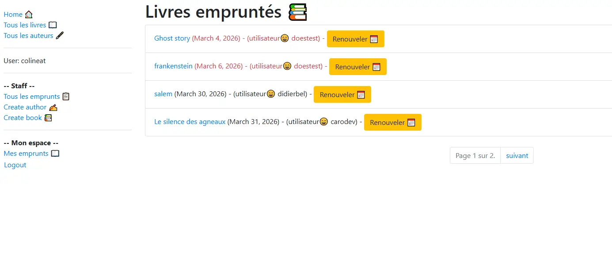

# Library with Django

Application web de gestion d'une bibliothèque locale, développée avec Django 6.



## Fonctionnalités

- Liste paginée des livres et des auteurs
- Page de détail pour chaque livre et auteur (URLs basées sur des slugs)
- Création, modification et suppression de livres et d'auteurs (staff uniquement)
- Gestion des copies de livres (BookInstance) : suppression individuelle des copies
- Authentification utilisateur (connexion / déconnexion)
- Réinitialisation du mot de passe par e-mail
- Espace personnel : liste des livres empruntés par l'utilisateur connecté
- Espace staff : liste de tous les emprunts en cours, avec renouvellement de date de retour
- Gestion des permissions via `is_staff` et les permissions Django (`can_mark_returned`, etc.)

## Stack technique

- **Python** 3.14
- **Django** 6.0.3
- **Bootstrap** 4.1.3
- **Base de données** : SQLite (développement)

## Installation

```bash
git clone https://github.com/Caro639/try-library-python.git
cd try-library-python/locallibrary
pip install -r requirements.txt
python manage.py migrate
python manage.py createsuperuser
python manage.py runserver
```

Accéder à l'application : [http://127.0.0.1:8000/catalog/](http://127.0.0.1:8000/catalog/)

## Structure du projet

```
locallibrary/
├── catalog/          # Application principale
│   ├── models.py     # Book, Author, BookInstance, Genre, Language
│   ├── views.py      # Vues (ListView, DetailView, CRUD, emprunt)
│   ├── urls.py       # Routes de l'application
│   ├── forms.py      # Formulaire de renouvellement
│   └── templates/    # Templates HTML
├── templates/
│   └── registration/ # Templates d'authentification (login, reset password…)
└── locallibrary/     # Configuration Django
    └── settings.py
```
